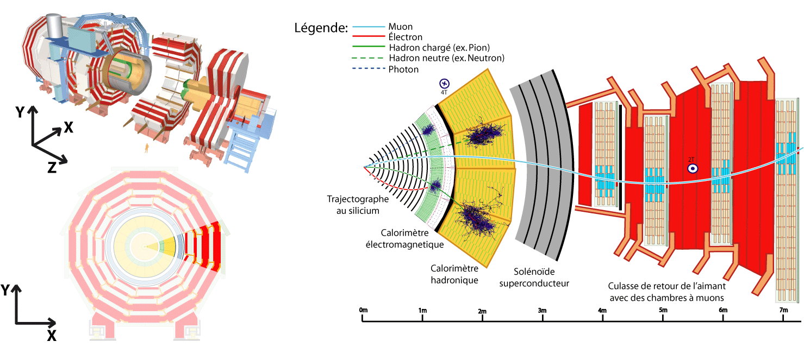

:::::::::::::::::::: questions
- What do we call physics objects in CMS?
- How are physics objects reconstructed?
- How are physics objects represented in NanoAOD?
::::::::::::::::::::

::::::::::::::::::: objectives
- Learn about the different physics objects in CMS and get briefed on their reconstruction
- Learn more about the collection structure of NanoAOD
:::::::::::::::::::

## Overview

The **CMS experment** is a giant detector that acts like a camera that "photographs" particle collisions, allowing us to interpret their nature.

Certainly, we cannot directly observe all the particles created in the collisions because some of them decay very quickly or simply do not interact with our detector. However, *we can infer their presence*. If they decay to other stable particles and interact with the apparatus, they leave signals in the CMS subdetectors. These signals are used to reconstruct the decay products or infer their presence; we call these, **physics objects**. 

Physics objects are built with the information collected by the sensors of the CMS detector.  Take a look at the CMS experiment in the image below. This is a good recent [video](https://youtu.be/6gfvGTCWXaw) that you can watch later to get a quick feeling of how CMS looks now in Run 3.

{width="100%"}

Physics objects could be

*   muons
*   electrons
*   jets
*   photons
*   taus
*   missing transverse momentum

In the [CERN Open Portal](https://opendata.cern.ch) (CODP) site one can find a more detailed description of these physical objects and a list of them corresponding to [2010](https://opendata.cern.ch/docs/cms-physics-objects-2010), [2011/2012](https://opendata.cern.ch/docs/cms-physics-objects-2011), and [2015/2016](https://opendata.cern.ch/docs/cms-physics-objects-2015) releases of open data. 

In this workshop we will focus on working with open data from the **latest 2016 release** from Run 2. This release included the [NanoAOD file format](https://opendata.cern.ch/docs/cms-getting-started-nanoaod) that contains the most commonly used physics object information in a standard ROOT tree. 

## Physics Objects reconstruction

Physics objects are mainly **reconstructed** using methods like clustering and linking parts of a CMS subsystem to parts of other CMS subsystems.  For instance, electromagnetic objects (electrons or photons) are reconstructed by the linking of tracks with ECAL energy deposits.

{width="100%"}

These actions are essential parts of the so-called **Particle Flow** (PF) algorithm.

{width="100%"}

The **particle-flow (PF) algorithm** aims at reconstructing and identifying all stable particles in the event, i.e., electrons, muons, photons, charged hadrons and neutral hadrons, with a thorough combination of all CMS sub-detectors towards an optimal determination of their direction, energy and type. This **list of individual particles is then used**, as if it came from a Monte-Carlo event generator, to build jets (from which the quark and gluon energies and directions are inferred), to determine the missing transverse energy (which gives an estimate of the direction and energy of the neutrinos and other invisible particles), to reconstruct and identify taus from their decay products and more.

The PF algorithm and all its reconstruction tributaries are written in C++ and are part of the **CMSSW** software that is required to analyze any open data in the earlier AOD or MiniAOD formats. For more information about the PF algorithm you can visit a lesson from an earlier workshop: [Advanced Tools lesson](https://cms-opendata-workshop.github.io/workshop2023-advobjects/). The CMS open data from 2016 contains some data samples in the NanoAOD format that have been supplemented with particle flow information: [nanoad-pf samples](https://opendata.cern.ch/search?q=&f=experiment%3ACMS&f=file_type%3Ananoaod-pf).

:::::::::::::::::: keypoints
- Physics objects are the final abstraction in the detector that can be associated to physical entities like particles.
- NanoAOD stores physics object properties as branches of a ROOT tree, linked by common name prefixes.
::::::::::::::::::

