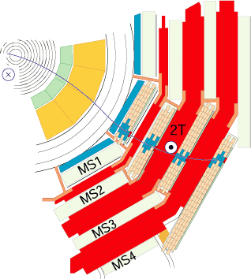
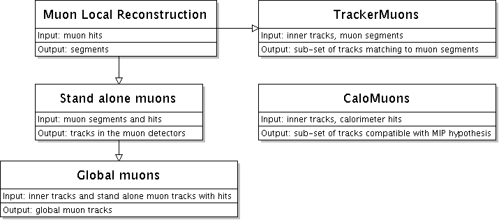
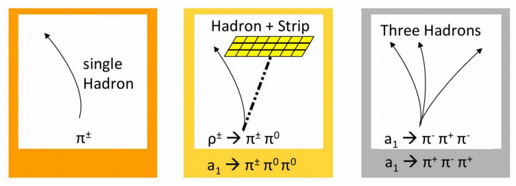

:::::::: questions

- How are muons reconstructed in CMS?
- How are muons treated in CMS OpenData?

::::::::

:::::::: objectives

- Understand how muons are reconstructed in CMS
- Learn variables for muon track-based quantities
- Learn variables for identification and isolation of muons

::::::::

## Overview of muon reconstruction

Muons are the *M* in CMS (Compact Muon Solenoid).  This is in part because they are reconstructed basically using all the CMS sub-detectors.  As it nicely summarized [here](https://cms.cern/detector/detecting-muons):

*[A muon] is measured by fitting a curve to the hits registered in the four muon stations, which are located outside of the magnet coil, interleaved with iron "return yoke" plates. The particle path is measured by tracking its position through the multiple active layers of each station; for improved precision, this information is combined with the CMS silicon tracker measurements. Measuring the trajectory provides a measurement of particle momentum. Indeed, the strong magnetic field generated by the CMS solenoid bends the particle's trajectory, with a bending radius that depends on its momentum: the more straight the track, the higher the momentum.*

Depending essentially on the kind of sub-detectors were used to reconstruct muons, they are usually classified accroding to the summary image below.

Muons have many features in common with electrons, but their own unique identification algorithms. We will use the same NanoAOD file as in the previous episode to look at the Muon NanoAOD branches.

::::::::::::::::::: spoiler

## Muon collection branches

Table: NanoAOD muon collection variables

| Object property | Type | Description |
| --------------- | ---- | ----------- |
| Muon_charge | Int_t | electric charge |
| Muon_cleanmask | UChar_t | simple cleaning mask with priority to leptons |
| Muon_dxy | Float_t | dxy (with sign) wrt first PV, in cm |
| Muon_dxyErr | Float_t | dxy uncertainty, in cm |
| Muon_dxybs | Float_t | dxy (with sign) wrt the beam spot, in cm |
| Muon_dz | Float_t | dz (with sign) wrt first PV, in cm |
| Muon_dzErr | Float_t | dz uncertainty, in cm |
| Muon_eta | Float_t | eta |
| Muon_fsrPhotonIdx | Int_t | (index to Fsrphoton) Index of the associated FSR photon |
| Muon_highPtId | UChar_t | high-pT cut-based ID (1 = tracker high pT, 2 = global high pT, which includes tracker high pT) |
| Muon_highPurity | Bool_t | inner track is high purity |
| Muon_inTimeMuon | Bool_t | inTimeMuon ID |
| Muon_ip3d | Float_t | 3D impact parameter wrt first PV, in cm |
| Muon_isGlobal | Bool_t | muon is global muon |
| Muon_isPFcand | Bool_t | muon is PF candidate |
| Muon_isStandalone | Bool_t | muon is a standalone muon |
| Muon_isTracker | Bool_t | muon is tracker muon |
| Muon_jetIdx | Int_t | (index to Jet) index of the associated jet (-1 if none) |
| Muon_jetNDauCharged | UChar_t | number of charged daughters of the closest jet |
| Muon_jetPtRelv2 | Float_t | Relative momentum of the lepton with respect to the closest jet after subtracting the lepton |
| Muon_jetRelIso | Float_t | Relative isolation in matched jet (1/ptRatio-1, pfRelIso04_all if no matched jet) |
| Muon_looseId | Bool_t | muon is loose muon |
| Muon_mass | Float_t | mass |
| Muon_mediumId | Bool_t | cut-based ID, medium WP |
| Muon_mediumPromptId | Bool_t | cut-based ID, medium prompt WP |
| Muon_miniIsoId | UChar_t | MiniIso ID from miniAOD selector (1=MiniIsoLoose, 2=MiniIsoMedium, 3=MiniIsoTight, 4=MiniIsoVeryTight) |
| Muon_miniPFRelIso_all | Float_t | mini PF relative isolation, total (with scaled rho*EA PU corrections) |
| Muon_miniPFRelIso_chg | Float_t | mini PF relative isolation, charged component |
| Muon_multiIsoId | UChar_t | MultiIsoId from miniAOD selector (1=MultiIsoLoose, 2=MultiIsoMedium) |
| Muon_mvaId | UChar_t | Mva ID from miniAOD selector (1=MvaLoose, 2=MvaMedium, 3=MvaTight, 4=MvaVTight, 5=MvaVVTight) |
| Muon_mvaLowPt | Float_t | Low pt muon ID score |
| Muon_mvaLowPtId | UChar_t | Low Pt Mva ID from miniAOD selector (1=LowPtMvaLoose, 2=LowPtMvaMedium) |
| Muon_mvaTTH | Float_t | TTH MVA lepton ID score |
| Muon_nStations | Int_t | number of matched stations with default arbitration (segment & track) |
| Muon_nTrackerLayers | Int_t | number of layers in the tracker |
| Muon_pdgId | Int_t | PDG code assigned by the event reconstruction (not by MC truth) |
| Muon_pfIsoId | UChar_t | PFIso ID from miniAOD selector (1=PFIsoVeryLoose, 2=PFIsoLoose, 3=PFIsoMedium, 4=PFIsoTight, 5=PFIsoVeryTight, 6=PFIsoVeryVeryTight) |
| Muon_pfRelIso03_all | Float_t | PF relative isolation dR=0.3, total (deltaBeta corrections) |
| Muon_pfRelIso03_chg | Float_t | PF relative isolation dR=0.3, charged component |
| Muon_pfRelIso04_all | Float_t | PF relative isolation dR=0.4, total (deltaBeta corrections) |
| Muon_phi | Float_t | phi |
| Muon_pt | Float_t | pt |
| Muon_ptErr | Float_t | ptError of the muon track |
| Muon_puppiIsoId | UChar_t | PuppiIsoId from miniAOD selector (1=Loose, 2=Medium, 3=Tight) |
| Muon_segmentComp | Float_t | muon segment compatibility |
| Muon_sip3d | Float_t | 3D impact parameter significance wrt first PV |
| Muon_softId | Bool_t | soft cut-based ID |
| Muon_softMva | Float_t | soft MVA ID score |
| Muon_softMvaId | Bool_t | soft MVA ID |
| Muon_tightCharge | Int_t | Tight charge criterion using pterr/pt of muonBestTrack (0:fail, 2:pass) |
| Muon_tightId | Bool_t | cut-based ID, tight WP |
| Muon_tkIsoId | UChar_t | TkIso ID (1=TkIsoLoose, 2=TkIsoTight) |
| Muon_tkRelIso | Float_t | Tracker-based relative isolation dR=0.3 for highPt, trkIso/tunePpt |
| Muon_triggerIdLoose | Bool_t | TriggerIdLoose ID |
| Muon_tunepRelPt | Float_t | TuneP relative pt, tunePpt/pt |
| nMuon | UInt_t | slimmedMuons after basic selection (pt > 15 || (pt > 3 && (passed('CutBasedIdLoose') || passed('SoftCutBasedId') || passed('SoftMvaId') || passed('CutBasedIdGlobalHighPt') || passed('CutBasedIdTrkHighPt')))) |

:::::::::::::::::::

### Muon 4-vector and track-related variables

These branches for muons are very similar to those we saw earlier for electrons: 

* `pt`, `eta`, `phi`, and `mass` form the 4-vector
* `charge` and `tightCharge` give electric charge information
* `dxy`, `dz`, `ip3d`, and their uncertainties or significances give impact parameter information 

Table: muon 4-vector and track-related branches

| Object property | Type | Description |
| --------------- | ---- | ----------- |
| Muon_charge | Int_t | electric charge |
| Muon_dxy | Float_t | dxy (with sign) wrt first PV, in cm |
| Muon_dxyErr | Float_t | dxy uncertainty, in cm |
| Muon_dxybs | Float_t | dxy (with sign) wrt the beam spot, in cm |
| Muon_dz | Float_t | dz (with sign) wrt first PV, in cm |
| Muon_dzErr | Float_t | dz uncertainty, in cm |
| Muon_eta | Float_t | eta |
| Muon_ip3d | Float_t | 3D impact parameter wrt first PV, in cm |
| Muon_mass | Float_t | mass |
| Muon_phi | Float_t | phi |
| Muon_pt | Float_t | pt |
| Muon_sip3d | Float_t | 3D impact parameter significance wrt first PV |
| Muon_tightCharge | Int_t | Tight charge criterion using pterr/pt of muonBestTrack (0:fail, 2:pass) |

### Muon identification and isolation

The CMS Muon object group has created member functions for the identification algorithms that store pass/fail decisions about the quality of each muon.
A set of cut-based identification working points are available: `looseId`, `mediumId`, `mediumPromptId`, `softId`, `highPtId`.
Another set of identification algorithms are based on MVA discriminants: `mvaId`, `mvaLowPtId`, `mvaTTH`, `softMvaId`.

Table: Muon identification variables

| Object property | Type | Description |
| --------------- | ---- | ----------- |
| Muon_highPtId | UChar_t | high-pT cut-based ID (1 = tracker high pT, 2 = global high pT, which includes tracker high pT) |
| Muon_looseId | Bool_t | muon is loose muon |
| Muon_mediumId | Bool_t | cut-based ID, medium WP |
| Muon_mediumPromptId | Bool_t | cut-based ID, medium prompt WP |
| Muon_mvaId | UChar_t | Mva ID from miniAOD selector (1=MvaLoose, 2=MvaMedium, 3=MvaTight, 4=MvaVTight, 5=MvaVVTight) |
| Muon_mvaLowPtId | UChar_t | Low Pt Mva ID from miniAOD selector (1=LowPtMvaLoose, 2=LowPtMvaMedium) |
| Muon_mvaTTH | Float_t | TTH MVA lepton ID score |
| Muon_softId | Bool_t | soft cut-based ID |
| Muon_softMvaId | Bool_t | soft MVA ID |
| Muon_tightId | Bool_t | cut-based ID, tight WP |

Hard processes produce large angles between the final state partons. The final object of interest will be separated from
the other objects in the event or be *isolated*. For instance, an isolated muon might be produced in the decay of a W boson.
In contrast, a non-isolated muon can come from a weak decay inside a jet.

Muon isolation is calculated from a combination of factors: energy from charged hadrons, energy from
neutral hadrons, and energy from photons, all in a cone of radius $R = \sqrt{\eta^2 + \phi^2} < 0.3$ or $<0.4$ around
the muon. Many algorithms also feature a *correction factor* that subtracts average energy expected
from pileup contributions to this con. The sum of the $p_{T}$ of the charged hadrons associated to vertices other
than the primary vertex, is used to correct for pileup contamination in the total flux of neutrals found in the muon isolation cone. 
A factor of $\beta = 0.5$ is used to scale this contribution as: 

$I_{\mu} = \frac{1}{p_{T}} \sum_{R<0.4} \left( p_{T}^{\mathrm{charged\,hadrons}} + \max(p_{T}^{\mathrm{photons}} + p_{T}^{\mathrm{neutral\,hadrons}} - \beta p_{T}^{\mathrm{charged\,pileup}} , 0) \right)$

Many forms of muon isolation are stored in NanoAOD, as shown in the table. The primary particle-flow isolation variable is `Muon_pfIsoId`. 
Another type of isolation in common us is "mini"-isolation, `Muon_miniIsoId`, which adapts the size of the cone to improve efficiency for leptons that might
exist near jets because they were decay products of a high-momentum particle, such as a top quark.

Table: Muon isolation variables

| Object property | Type | Description |
| --------------- | ---- | ----------- |
| Muon_jetRelIso | Float_t | Relative isolation in matched jet (1/ptRatio-1, pfRelIso04_all if no matched jet) |
| Muon_miniIsoId | UChar_t | MiniIso ID from miniAOD selector (1=MiniIsoLoose, 2=MiniIsoMedium, 3=MiniIsoTight, 4=MiniIsoVeryTight) |
| Muon_miniPFRelIso_all | Float_t | mini PF relative isolation, total (with scaled rho*EA PU corrections) |
| Muon_miniPFRelIso_chg | Float_t | mini PF relative isolation, charged component |
| Muon_multiIsoId | UChar_t | MultiIsoId from miniAOD selector (1=MultiIsoLoose, 2=MultiIsoMedium) |
| Muon_pfIsoId | UChar_t | PFIso ID from miniAOD selector (1=PFIsoVeryLoose, 2=PFIsoLoose, 3=PFIsoMedium, 4=PFIsoTight, 5=PFIsoVeryTight, 6=PFIsoVeryVeryTight) |
| Muon_pfRelIso03_all | Float_t | PF relative isolation dR=0.3, total (deltaBeta corrections) |
| Muon_pfRelIso03_chg | Float_t | PF relative isolation dR=0.3, charged component |
| Muon_pfRelIso04_all | Float_t | PF relative isolation dR=0.4, total (deltaBeta corrections) |
| Muon_puppiIsoId | UChar_t | PuppiIsoId from miniAOD selector (1=Loose, 2=Medium, 3=Tight) |
| Muon_tkIsoId | UChar_t | TkIso ID (1=TkIsoLoose, 2=TkIsoTight) |
| Muon_tkRelIso | Float_t | Tracker-based relative isolation dR=0.3 for highPt, trkIso/tunePpt |

### Muon cross-reference indices

Like electrons, muons can be cross-referenced to other arrays in the NanoAOD file: 

Table: Muon cross-reference indices

| Object property | Type | Description |
| --------------- | ---- | ----------- |
| Muon_fsrPhotonIdx | Int_t | (index to Fsrphoton) Index of the associated FSR photon |
| Muon_jetIdx | Int_t | (index to Jet) index of the associated jet (-1 if none) |

## Tau leptons

The CMS Tau object group relies almost entirely on pre-computed algorithms to determine the quality of the tau reconstruction and the decay type.
Since this object is not stable and has several decay modes, different combinations of identification and isolation algorithms are used across different analyses.
The [Run 1 Tau ID page](https://twiki.cern.ch/twiki/bin/view/CMSPublic/WorkBookPFTauTagging#Legacy_Tau_ID_Run_I) and [Nutshell Recipe](https://twiki.cern.ch/twiki/bin/view/CMSPublic/NutShellRecipeFor5312AndNewer) provide a large table of algorithms that remains a valuable reference.

Taus that decay to leptons are typically identified as electrons or muons in CMS. But taus that decay to hadrons can be identified in the calorimeters based on the characteristic
size and shape of their clusters.

::::::::::::::::::::::: spoiler

## Tau collection branches

Table: Tau collection branches

| Object property | Type | Description |
| --------------- | ---- | ----------- |
| Tau_charge | Int_t | electric charge |
| Tau_chargedIso | Float_t | charged isolation |
| Tau_cleanmask | UChar_t | simple cleaning mask with priority to leptons |
| Tau_decayMode | Int_t | decayMode() |
| Tau_dxy | Float_t | d_{xy} of lead track with respect to PV, in cm (with sign) |
| Tau_dz | Float_t | d_{z} of lead track with respect to PV, in cm (with sign) |
| Tau_eta | Float_t | eta |
| Tau_idAntiEleDeadECal | Bool_t | Anti-electron dead-ECal discriminator |
| Tau_idAntiMu | UChar_t | Anti-muon discriminator V3: : bitmask 1 = Loose, 2 = Tight |
| Tau_idDecayModeOldDMs | Bool_t | tauID('decayModeFinding') |
| Tau_idDeepTau2017v2p1VSe | UChar_t | byDeepTau2017v2p1VSe ID working points (deepTau2017v2p1): bitmask 1 = VVVLoose, 2 = VVLoose, 4 = VLoose, 8 = Loose, 16 = Medium, 32 = Tight, 64 = VTight, 128 = VVTight |
| Tau_idDeepTau2017v2p1VSjet | UChar_t | byDeepTau2017v2p1VSjet ID working points (deepTau2017v2p1): bitmask 1 = VVVLoose, 2 = VVLoose, 4 = VLoose, 8 = Loose, 16 = Medium, 32 = Tight, 64 = VTight, 128 = VVTight |
| Tau_idDeepTau2017v2p1VSmu | UChar_t | byDeepTau2017v2p1VSmu ID working points (deepTau2017v2p1): bitmask 1 = VLoose, 2 = Loose, 4 = Medium, 8 = Tight |
| Tau_jetIdx | Int_t | (index to Jet) index of the associated jet (-1 if none) |
| Tau_leadTkDeltaEta | Float_t | eta of the leading track, minus tau eta |
| Tau_leadTkDeltaPhi | Float_t | phi of the leading track, minus tau phi |
| Tau_leadTkPtOverTauPt | Float_t | pt of the leading track divided by tau pt |
| Tau_mass | Float_t | mass |
| Tau_neutralIso | Float_t | neutral (photon) isolation |
| Tau_phi | Float_t | phi |
| Tau_photonsOutsideSignalCone | Float_t | sum of photons outside signal cone |
| Tau_pt | Float_t | pt |
| Tau_puCorr | Float_t | pileup correction |
| Tau_rawDeepTau2017v2p1VSe | Float_t | byDeepTau2017v2p1VSe raw output discriminator (deepTau2017v2p1) |
| Tau_rawDeepTau2017v2p1VSjet | Float_t | byDeepTau2017v2p1VSjet raw output discriminator (deepTau2017v2p1) |
| Tau_rawDeepTau2017v2p1VSmu | Float_t | byDeepTau2017v2p1VSmu raw output discriminator (deepTau2017v2p1) |
| Tau_rawIso | Float_t | combined isolation (deltaBeta corrections) |
| Tau_rawIsodR03 | Float_t | combined isolation (deltaBeta corrections, dR=0.3) |
| nTau | UInt_t | slimmedTaus after basic selection (pt > 18 && tauID('decayModeFindingNewDMs') && (tauID('byLooseCombinedIsolationDeltaBetaCorr3Hits') || (tauID('chargedIsoPtSumdR03')+max(0.,tauID('neutralIsoPtSumdR03')-0.072*tauID('puCorrPtSum'))<2.5) || tauID('byVVVLooseDeepTau2017v2p1VSjet'))) |

::::::::::::::::::::::::::::

### Tau identification variables

The following variables in the tau collection represent the identification and isolation variables. 

Table: Tau identification variables

| Object property | Type | Description |
| --------------- | ---- | ----------- |
| Tau_decayMode | Int_t | decayMode() |
| Tau_idAntiEleDeadECal | Bool_t | Anti-electron dead-ECal discriminator |
| Tau_idAntiMu | UChar_t | Anti-muon discriminator V3: : bitmask 1 = Loose, 2 = Tight |
| Tau_idDecayModeOldDMs | Bool_t | tauID('decayModeFinding') |
| Tau_idDeepTau2017v2p1VSe | UChar_t | byDeepTau2017v2p1VSe ID working points (deepTau2017v2p1): bitmask 1 = VVVLoose, 2 = VVLoose, 4 = VLoose, 8 = Loose, 16 = Medium, 32 = Tight, 64 = VTight, 128 = VVTight |
| Tau_idDeepTau2017v2p1VSjet | UChar_t | byDeepTau2017v2p1VSjet ID working points (deepTau2017v2p1): bitmask 1 = VVVLoose, 2 = VVLoose, 4 = VLoose, 8 = Loose, 16 = Medium, 32 = Tight, 64 = VTight, 128 = VVTight |
| Tau_idDeepTau2017v2p1VSmu | UChar_t | byDeepTau2017v2p1VSmu ID working points (deepTau2017v2p1): bitmask 1 = VLoose, 2 = Loose, 4 = Medium, 8 = Tight |
| Tau_rawIso | Float_t | combined isolation (deltaBeta corrections) |
| Tau_rawIsodR03 | Float_t | combined isolation (deltaBeta corrections, dR=0.3) |

### Other tau information

Information about the tau lepton 4-vectors, cross-reference indices, impact parameters, etc, are analogous to the variables for electrons and muons. 

:::::::: keypoints

- Track access may differ, but track-related member functions are common across objects.
- Physics objects in CMS are reconstructed from detector signals and are never 100% certain!
- Muons typically use pre-configured identification and isolation variables"

::::::::

