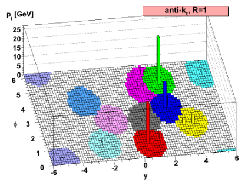

:::::::: questions
- How are jets and missing transverse energy treated in CMS Open Data?
::::::::

:::::::: objectives
- Identify jet and MET code collections in AOD files
- Understand typical features of jet/MET objects
::::::::

After tracks and energy deposits in the CMS tracking detectors (inner, muon) and calorimeters (electromagnetic, hadronic) are reconstructed as particle flow candidates, an event can be interpreted in various ways. Two common elements of event interpretation are **clustering jets** and calculating **missing transverse momentum**.

## Jets

Jets are spatially-grouped collections of long-lived particles that are produced when a quark or gluon hadronizes. The kinetmatic properties of
jets resemble that of the initial partons that produced them. In the CMS language, jets are made up of many particles, with the
following predictable energy composition:

*   ~65% charged hadrons
*   ~25% photons (from neutral pions)
*   ~10% neutral hadrons

Jets are very messy! Hadronization and the subsequent decays of unstable hadrons can produce 100s of particles near each other in the CMS detector.
Hence these particles are rarely analyzed individually. How can we determine which particle candidates should be included in each jet?

### Clustering

Jets can be clustered using a variety of different inputs from the CMS detector. "CaloJets" use only calorimeter energy deposits. "GenJets" use generated
particles from a simulation. But by far the most common are "PFJets", from **particle flow candidates**.

The result of the CMS Particle Flow algorithm is a list of particle candidates that account for all inner-tracker and muon tracks and all above-threshold
energy deposits in the calorimeters. These particles are formed into jets using a "clustering algorithm". The most common algorithm used by CMS is the
"anti-kt" algorithm, which is abbreviated "AK". It iterates over particle pairs and finds the two (*i* and *j*) that are the closest in some distance
measure and determines whether to combine them:

$d_{ij} = \min(p^{-2}_{T,i},p^{-2}_{T,j}) \Delta R^2_{ij}/R^2$

Particle pairs are combined as long as $d_{ij} < p^{-2}_{T,i}$. The momentum power (-2) used by the anti-kt algorithm means that higher-momentum particles are clustered first.
This leads to jets with a round shape that tend to be centered on the hardest particle. In CMS software this clustering is implemented using the [FastJet](www.fastjet.fr) package. 

{width="100%"}

### Pileup

Inevitably, the list of particle flow candidates contains particles that did not originate from the primary interaction point. CMS experiences multiple
simultaneous collisions, called "pileup", during each "bunch crossing" of the LHC, so particles from multiple collisions coexist in the detector.
There are various methods to remove their contributions from jets:

 * Charged hadron subtraction [CHS](http://cms-results.web.cern.ch/cms-results/public-results/preliminary-results/JME-14-001/index.html): all charged hadron candidates 
 are associated with a track. If the track is not associated with the primary vertex, that
 charged hadron can be removed from the list. CHS is limited to the region of the detector covered by the inner tracker. The pileup contribution to
 neutral hadrons has to be removed mathematically -- more in episode 3!
 * PileUp Per Particle Identification (PUPPI, available in Run 2): CHS is applied, and then all remaining particles are weighted based on their likelihood of arising from
 pileup. This method is more stable and performant in high pileup scenarios such as the upcoming HL-LHC era.

## Small-radius jets in NanoAOD

The most basic setting for anti-kt particle-flow jets in CMS is a radius parameter of 0.4. These jets are often called "AK4 jets" or "small-radius jets". Their information is stored in the "Jet_*" collection in NanoAOD:

:::::::::::::::: spoiler

## Jet collection branches

Table: Jet collection branches

| Object property | Type | Description |
| --------------- | ---- | -----------  |
| Jet_area | Float_t | jet catchment area, for JECs |
| Jet_bRegCorr | Float_t | pt correction for b-jet energy regression |
| Jet_bRegRes | Float_t | res on pt corrected with b-jet regression |
| Jet_btagCSVV2 | Float_t | pfCombinedInclusiveSecondaryVertexV2 b-tag discriminator (aka CSVV2) |
| Jet_btagDeepB | Float_t | DeepCSV b+bb tag discriminator |
| Jet_btagDeepCvB | Float_t | DeepCSV c vs b+bb discriminator |
| Jet_btagDeepCvL | Float_t | DeepCSV c vs udsg discriminator |
| Jet_btagDeepFlavB | Float_t | DeepJet b+bb+lepb tag discriminator |
| Jet_btagDeepFlavCvB | Float_t | DeepJet c vs b+bb+lepb discriminator |
| Jet_btagDeepFlavCvL | Float_t | DeepJet c vs uds+g discriminator |
| Jet_btagDeepFlavQG | Float_t | DeepJet g vs uds discriminator |
| Jet_cRegCorr | Float_t | pt correction for c-jet energy regression |
| Jet_cRegRes | Float_t | res on pt corrected with c-jet regression |
| Jet_chEmEF | Float_t | charged Electromagnetic Energy Fraction |
| Jet_chFPV0EF | Float_t | charged fromPV==0 Energy Fraction (energy excluded from CHS jets). Previously called betastar. |
| Jet_chHEF | Float_t | charged Hadron Energy Fraction |
| Jet_cleanmask | UChar_t | simple cleaning mask with priority to leptons |
| Jet_electronIdx1 | Int_t | (index to Electron) index of first matching electron |
| Jet_electronIdx2 | Int_t | (index to Electron) index of second matching electron |
| Jet_eta | Float_t | eta |
| Jet_hfadjacentEtaStripsSize | Int_t | eta size of the strips next to the central tower strip in HF (noise discriminating variable) |
| Jet_hfcentralEtaStripSize | Int_t | eta size of the central tower strip in HF (noise discriminating variable) |
| Jet_hfsigmaEtaEta | Float_t | sigmaEtaEta for HF jets (noise discriminating variable) |
| Jet_hfsigmaPhiPhi | Float_t | sigmaPhiPhi for HF jets (noise discriminating variable) |
| Jet_jetId | Int_t | Jet ID flags bit1 is loose (always false in 2017 since it does not exist), bit2 is tight, bit3 is tightLepVeto |
| Jet_mass | Float_t | mass |
| Jet_muEF | Float_t | muon Energy Fraction |
| Jet_muonIdx1 | Int_t | (index to Muon) index of first matching muon |
| Jet_muonIdx2 | Int_t | (index to Muon) index of second matching muon |
| Jet_muonSubtrFactor | Float_t | 1-(muon-subtracted raw pt)/(raw pt) |
| Jet_nConstituents | UChar_t | Number of particles in the jet |
| Jet_nElectrons | Int_t | number of electrons in the jet |
| Jet_nMuons | Int_t | number of muons in the jet |
| Jet_neEmEF | Float_t | neutral Electromagnetic Energy Fraction |
| Jet_neHEF | Float_t | neutral Hadron Energy Fraction |
| Jet_phi | Float_t | phi |
| Jet_pt | Float_t | pt |
| Jet_puId | Int_t | Pileup ID flags with 106X (2016) training |
| Jet_puIdDisc | Float_t | Pileup ID discriminant with 106X (2016) training |
| Jet_qgl | Float_t | Quark vs Gluon likelihood discriminator |
| Jet_rawFactor | Float_t | 1 - Factor to get back to raw pT |
| nJet | UInt_t | slimmedJets, i.e. ak4 PFJets CHS with JECs applied, after basic selection (pt > 15) |
 
::::::::::::::::

By now you should be able to identify the 4-vector information and the cross-reference indices in this list of branches!
Many of the variables in the list will be discussed in the later lesson pages on heavy flavor tagging and jet energy corrections.

### Jet identification

Particle-flow jets are not immune to noise in the detector, and jets used in analyses should be filtered to remove noise jets. 
CMS has defined a "noise jet ID" that considers information about the energy types within the jet:

* charged hadron fraction -- what fraction of the jet consists of charged hadrons? This will be greater than 0 if the jet is within the inner tracker region.
* neutral hadron fraction -- what fraction of the jet consists of neutral hadrons? This should always be less than 1.
* charged electromagnetic fraction -- what fraction of the jet consists of electrons? This should always be less than 1.
* neutral electromagnetic fraction -- what fraction of the jet consists of photons? This should always be less than 1.
* number of constituents -- this should be greater than 1. 

These criteria demonstrate how particle-flow jets combine information across subdetectors. Jets will typically have energy from electrons and photons, but those fractions of the total
energy should be less than one. Similarly, jets should have some energy from charged hadrons if they overlap the inner tracker, and all the energy should not come from neutral hadrons. 
A mixture of energy sources is expected for genuine jets. All of these energy fractions (and more) can be accessed in NanoAOD. Whenever you use jets, requirements should be placed
on the value of `Jet_jetId`, rejecting at least values of 0.

Table: Jet collection branches

| Object property | Type | Description |
| --------------- | ---- | -----------  |
| Jet_chEmEF | Float_t | charged Electromagnetic Energy Fraction |
| Jet_chFPV0EF | Float_t | charged fromPV==0 Energy Fraction (energy excluded from CHS jets). Previously called betastar. |
| Jet_chHEF | Float_t | charged Hadron Energy Fraction |
| Jet_jetId | Int_t | Jet ID flags bit1 is loose (always false in 2017 since it does not exist), bit2 is tight, bit3 is tightLepVeto |
| Jet_muEF | Float_t | muon Energy Fraction |
| Jet_nConstituents | UChar_t | Number of particles in the jet |
| Jet_nElectrons | Int_t | number of electrons in the jet |
| Jet_nMuons | Int_t | number of muons in the jet |
| Jet_neEmEF | Float_t | neutral Electromagnetic Energy Fraction |
| Jet_neHEF | Float_t | neutral Hadron Energy Fraction |
| Jet_puId | Int_t | Pileup ID flags with 106X (2016) training |

Another important identification algorithm is the "pileup jet ID", which can identify jets that are not likely to come from the primary collision of an event.

## Large-radius jets in NanoAOD

Another useful anti-kt jet radius is 0.8, called "AK8 jets" or "large-radius jets". These jets are stored if they have transverse momentum above 170 GeV, and
are represented by the "FatJet_*" collection in NanoAOD:

:::::::::::::::: spoiler

## FatJet collection branches

Table: Jet collection branches

| Object property | Type | Description |
| --------------- | ---- | -----------  |
| FatJet_area | Float_t | jet catchment area, for JECs |
| FatJet_btagCSVV2 | Float_t | pfCombinedInclusiveSecondaryVertexV2 b-tag discriminator (aka CSVV2) |
| FatJet_btagDDBvLV2 | Float_t | DeepDoubleX V2(mass-decorrelated) discriminator for H(Z)->bb vs QCD |
| FatJet_btagDDCvBV2 | Float_t | DeepDoubleX V2 (mass-decorrelated) discriminator for H(Z)->cc vs H(Z)->bb |
| FatJet_btagDDCvLV2 | Float_t | DeepDoubleX V2 (mass-decorrelated) discriminator for H(Z)->cc vs QCD |
| FatJet_btagDeepB | Float_t | DeepCSV b+bb tag discriminator |
| FatJet_btagHbb | Float_t | Higgs to BB tagger discriminator |
| FatJet_deepTagMD_H4qvsQCD | Float_t | Mass-decorrelated DeepBoostedJet tagger H->4q vs QCD discriminator |
| FatJet_deepTagMD_HbbvsQCD | Float_t | Mass-decorrelated DeepBoostedJet tagger H->bb vs QCD discriminator |
| FatJet_deepTagMD_TvsQCD | Float_t | Mass-decorrelated DeepBoostedJet tagger top vs QCD discriminator |
| FatJet_deepTagMD_WvsQCD | Float_t | Mass-decorrelated DeepBoostedJet tagger W vs QCD discriminator |
| FatJet_deepTagMD_ZHbbvsQCD | Float_t | Mass-decorrelated DeepBoostedJet tagger Z/H->bb vs QCD discriminator |
| FatJet_deepTagMD_ZHccvsQCD | Float_t | Mass-decorrelated DeepBoostedJet tagger Z/H->cc vs QCD discriminator |
| FatJet_deepTagMD_ZbbvsQCD | Float_t | Mass-decorrelated DeepBoostedJet tagger Z->bb vs QCD discriminator |
| FatJet_deepTagMD_ZvsQCD | Float_t | Mass-decorrelated DeepBoostedJet tagger Z vs QCD discriminator |
| FatJet_deepTagMD_bbvsLight | Float_t | Mass-decorrelated DeepBoostedJet tagger Z/H/gluon->bb vs light flavour discriminator |
| FatJet_deepTagMD_ccvsLight | Float_t | Mass-decorrelated DeepBoostedJet tagger Z/H/gluon->cc vs light flavour discriminator |
| FatJet_deepTag_H | Float_t | DeepBoostedJet tagger H(bb,cc,4q) sum |
| FatJet_deepTag_QCD | Float_t | DeepBoostedJet tagger QCD(bb,cc,b,c,others) sum |
| FatJet_deepTag_QCDothers | Float_t | DeepBoostedJet tagger QCDothers value |
| FatJet_deepTag_TvsQCD | Float_t | DeepBoostedJet tagger top vs QCD discriminator |
| FatJet_deepTag_WvsQCD | Float_t | DeepBoostedJet tagger W vs QCD discriminator |
| FatJet_deepTag_ZvsQCD | Float_t | DeepBoostedJet tagger Z vs QCD discriminator |
| FatJet_electronIdx3SJ | Int_t | (index to Electron) index of electron matched to jet |
| FatJet_eta | Float_t | eta |
| FatJet_jetId | Int_t | Jet ID flags bit1 is loose (always false in 2017 since it does not exist), bit2 is tight, bit3 is tightLepVeto |
| FatJet_lsf3 | Float_t | Lepton Subjet Fraction (3 subjets) |
| FatJet_mass | Float_t | mass |
| FatJet_msoftdrop | Float_t | Corrected soft drop mass with PUPPI |
| FatJet_muonIdx3SJ | Int_t | (index to Muon) index of muon matched to jet |
| FatJet_n2b1 | Float_t | N2 with beta=1 |
| FatJet_n3b1 | Float_t | N3 with beta=1 |
| FatJet_nConstituents | UChar_t | Number of particles in the jet |
| FatJet_particleNetMD_QCD | Float_t | Mass-decorrelated ParticleNet tagger raw QCD score |
| FatJet_particleNetMD_Xbb | Float_t | Mass-decorrelated ParticleNet tagger raw X->bb score. For X->bb vs QCD tagging, use Xbb/(Xbb+QCD) |
| FatJet_particleNetMD_Xcc | Float_t | Mass-decorrelated ParticleNet tagger raw X->cc score. For X->cc vs QCD tagging, use Xcc/(Xcc+QCD) |
| FatJet_particleNetMD_Xqq | Float_t | Mass-decorrelated ParticleNet tagger raw X->qq (uds) score. For X->qq vs QCD tagging, use Xqq/(Xqq+QCD). For W vs QCD tagging, use (Xcc+Xqq)/(Xcc+Xqq+QCD) |
| FatJet_particleNet_H4qvsQCD | Float_t | ParticleNet tagger H(->VV->qqqq) vs QCD discriminator |
| FatJet_particleNet_HbbvsQCD | Float_t | ParticleNet tagger H(->bb) vs QCD discriminator |
| FatJet_particleNet_HccvsQCD | Float_t | ParticleNet tagger H(->cc) vs QCD discriminator |
| FatJet_particleNet_QCD | Float_t | ParticleNet tagger QCD(bb,cc,b,c,others) sum |
| FatJet_particleNet_TvsQCD | Float_t | ParticleNet tagger top vs QCD discriminator |
| FatJet_particleNet_WvsQCD | Float_t | ParticleNet tagger W vs QCD discriminator |
| FatJet_particleNet_ZvsQCD | Float_t | ParticleNet tagger Z vs QCD discriminator |
| FatJet_particleNet_mass | Float_t | ParticleNet mass regression |
| FatJet_phi | Float_t | phi |
| FatJet_pt | Float_t | pt |
| FatJet_rawFactor | Float_t | 1 - Factor to get back to raw pT |
| FatJet_subJetIdx1 | Int_t | (index to Subjet) index of first subjet |
| FatJet_subJetIdx2 | Int_t | (index to Subjet) index of second subjet |
| FatJet_tau1 | Float_t | Nsubjettiness (1 axis) |
| FatJet_tau2 | Float_t | Nsubjettiness (2 axis) |
| FatJet_tau3 | Float_t | Nsubjettiness (3 axis) |
| FatJet_tau4 | Float_t | Nsubjettiness (4 axis) |
| nFatJet | UInt_t | slimmedJetsAK8, i.e. ak8 fat jets for boosted analysis |

:::::::::::::::::

Beyond the 4-vector information, `FatJet_jetId` variable, and cross-reference indices, the overwhelming majority of variables stored for FatJets are used
to identify hadronic decays of high-momentum massive SM particles like top quarks, Higgs bosons, W bosons, and Z bosons. This will be covered in a later lesson.

## MET

[Missing transverse momentum](https://cds.cern.ch/record/1543527) is the negative vector sum of the transverse momenta of all particle flow candidates in an event. 
The magnitude of the missing transverse momentum vector is called missing transverse energy and referred to with the acronym "MET". 
Since energy corrections are made to the particle flow jets (see the last page in this lesson), those corrections are propagated to MET by adding back the momentum vectors of the
original jets and then subtracting the momentum vectors of the corrected jets. This correction is called "Type 1" and is standard for all CMS analyses.

| Object property | Type | Description |
| --------------- | ---- | ----------- |
| MET_MetUnclustEnUpDeltaX | Float_t | Delta (METx_mod-METx) Unclustered Energy Up |
| MET_MetUnclustEnUpDeltaY | Float_t | Delta (METy_mod-METy) Unclustered Energy Up |
| MET_covXX | Float_t | xx element of met covariance matrix |
| MET_covXY | Float_t | xy element of met covariance matrix |
| MET_covYY | Float_t | yy element of met covariance matrix |
| MET_phi | Float_t | phi |
| MET_pt | Float_t | pt |
| MET_significance | Float_t | MET significance |
| MET_sumEt | Float_t | scalar sum of Et |
| MET_sumPtUnclustered | Float_t | sumPt used for MET significance |

The standard "MET" magnitude is found in `MET_pt`, and the azimuthal angle of the vector is `MET_phi` (since MET can only be computed in the transverse plane, no `MET_eta` is found).
The `MET_significance` variable can be a useful tool: it describes the likelihood that the MET arose from noise or mismeasurement in the detector
as opposed to a neutrino or similar non-interacting particle. The four-vectors of the other physics objects along with their 
uncertainties are required to compute the significance of the MET signature. MET that is directed nearly (anti)colinnear with 
a physics object is likely to arise from mismeasurement and should not have a large significance. 

:::::::: keypoints
- Jets are spatially-grouped collections of particles that traversed the CMS detector
- Particles from additional proton-proton collisions (pileup) must be removed from jets
- Missing transverse energy is the negative vector sum of particle candidates
- Many of the variables discussed for other objects also exist for jets
::::::::
