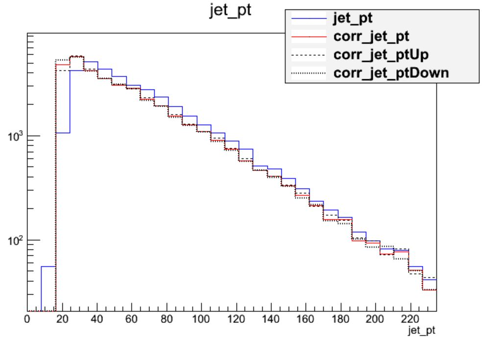
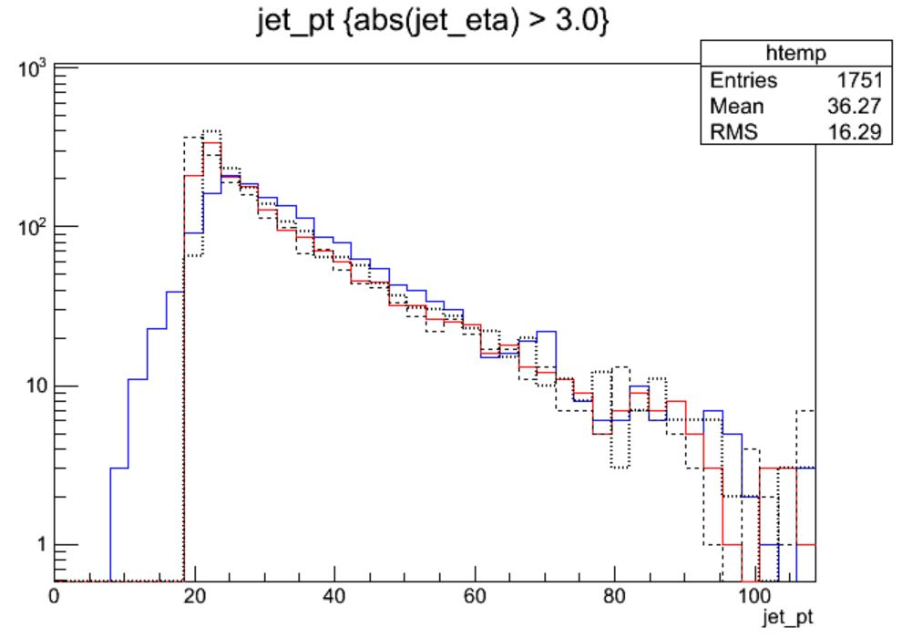
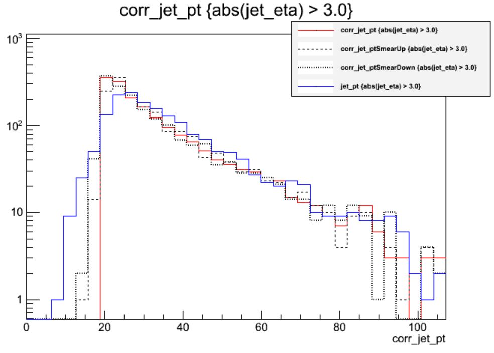

:::::::::::: questions
- How are data/simulation differences dealt with for jet energy?
- How do uncorrected and corrected jet momenta compare?
- How large is the JES uncertainty in different regions?
- How large is the JER uncertainty in different regions?
::::::::::::

:::::::::::: objectives
- Learn about typical differences in jet energy scale and resolution between data and simulation
- Explore the JES and JER uncertainties using histograms
::::::::::::

Unsurprisingly, the CMS detector does not measure jet energies perfectly, nor
do simulation and data agree perfectly! The measured energy of jet must be
corrected so that it can be related to the true energy of its parent particle.
These "Jet Energy Scale" (JES) corrections account for several effects and are factorized so that each
effect can be studied independently. All of the corrections in this section are described
in "Jet Energy Scale and Resolution" papers by CMS:
 * [2011, 7 TeV](https://arxiv.org/pdf/1107.4277.pdf)
 * [2017, 8 TeV](https://arxiv.org/abs/1607.03663)

## JES Correction levels

Particles from additional interactions in nearby bunch crossings of the LHC contribute energy in the calorimeters that must somehow be distinguished from the
energy deposits of the main interaction. Extra energy in a jet's cone can make its measured momentum larger than the momentum of the parent particle.
The first layer ("L1") of jet energy corrections accounts for pileup by subtracting the average transverse momentum contribution of the pileup interactions to
the jet's cone area. This average pileup contribution varies by pseudorapidity and, of course, by the number of interactions in the event. 

The second and third layers of corrections ("L2L3") correct the measured momentum to the true momentum as functions of momentum and pseudorapidity, bringing
the reconstructed jet in line with the generated jet. These corrections are derived using momentum balancing and missing energy techniques in dijet and Z
boson events. One well-measured object (ex: a jet near the center of the detector, a Z boson reconstructed from leptons) is balanced against a jet for which
corrections are derived.

All of these corrections are applied to both data and simulation. Data events are then given "residual" corrections to bring data into line with the corrected
simulation. A final set of flavor-based corrections are used in certain analyses that are especially sensitive to flavor effects.
The figure below shows the result of the L1+L2+L3 corrections on the jet response.

## Jet Energy Resolution

Jet Energy Resolution (JER) corrections are applied after JES on strictly MC simulations. Unlike JES, which adjusts the mean of the momentun response distribution, JER adjusts the width of the distribution. The ratio of reconstructed transverse momentum to true (generated) transverse momentum forms a Gaussian distributions -- the width of this Gaussian is the JER. In data, where no "true" pT is available, the JER is measured using photon/Z + jet events where the jet recoils against the photon or Z boson, both of which can be measured quite precisely in the CMS detector. The JER is typically smaller in simulation than in data, leading to scale factors that are larger than 1. These scale factors are applied using two methods:
 * [Adjusting the ratio](https://oaktrust.library.tamu.edu/handle/1969.1/173472) of reconstructed to generated momentum using the scale factor (if a well-matched generated jet is found),
 * Randomly smearing the momentum using a Gaussian distribution based on the resolution and scale factor (if no generated jet is found).

## Applying JES and JER

Earlier editions of this workshop documented a long process of applying the appropriate corrections to MiniAOD Open Data for 2015! The 2016 Open Data samples are "Ultra Legacy", and an appropriate set of corrections have already been applied to the jets.

::::::::: callout

## Application instructions coming soon!

Sometimes, you may need to reapply the jet corrections in an analysis, perhaps after removing leptons from jets. Instructions and examples to perform this process with NanoAOD samples will be included in the CMS Open Data Guide later in 2024.

::::::::::

## Uncertainties

All corrections have accompanying uncertainties. The JES uncertainties have several sources, shown in the figure below. The L1 (pileup) uncertainty dominates at low momentum,
while the L3 (absolute scale) uncertainty takes over for higher momentum jets. All corrections are quite precise for
jets located near the center of the CMS barrel region, and the precision drops as pseudorapidity increases and different
subdetectors lose coverage. 

The JER uncertainty is evaluated by shifting the scale factors up and down according to the error bars shown in the scale factor figure above. These uncertainties arise from treatment of initial and final state radiation in the data measurement, differences in Monte Carlo tunes across generator platforms, and small non-Gaussian tail effects.
The JER uncertainty is evaluated by re-calculating the smearing factor using the shifted scale factors. The uncertainties in JES and JER are kept separate from each other: when varying JES, the JER correction is held constant, and vice versa. This results in **5 momentum values** for each jet: a central value and two sets of uncertainties:

The JES corrections are significant, far larger than the uncertainty itself. The first level of correction, for pileup removal, tends to reduce the momentum of the jet, as seen in the left figure below that compares corrected to uncorrected jets. The right figure shows a similar comparison for JER smearing -- this uncertainty is much smaller for the majority of jets!

{width="48%"} | {width="48%"}

It is useful to make the same comparisons for jets in the forward regions of the CMS detector, where tracking is not available. The left (right) figure below shows JES (JER) effects for jets with pseudorapidity greater than 3. 

{width="48%"} | {width="48%"}

In the endcap region the uncertainty on the JER scale factor has become nearly 20%! So this uncertainty gains almost equal footing with JES.
Many CMS analyses restrict themselves to studying jets in the "central" region of the detector, defined loosely by the tracker acceptance region of `abs(eta) < 2.4` precisely to
avoid these larger JES and JER uncertainties.

::::::::: callout

## Uncertainty instructions coming soon!

Methods to evaluate JES and JER uncertainties for NanoAOD files will also be included in the CMS Open Data Guide later in 2024.

::::::::::

:::::::::::: keypoints
- Jet energy corrections are factorized and account for many mismeasurement effects
- L1+L2+L3 should be applied to jets used for analyses, with residual corrections for data
- Jet energy resolution in simulation is typically too narrow and is smeared using scale factors
- Jet energy and resolution corrections are sources of systematic error and uncertainties should be evaluated
- In general, the jet corrections are significant and lower the momenta of the jets with standard LHC pileup conditions
- For most jets, the JES uncertainty dominates over the JER uncertainty
- In the endcap region of the detector, the JER uncertainty in larger and matches the JES uncertainty
::::::::::::
